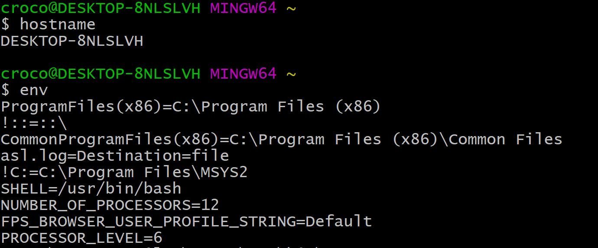
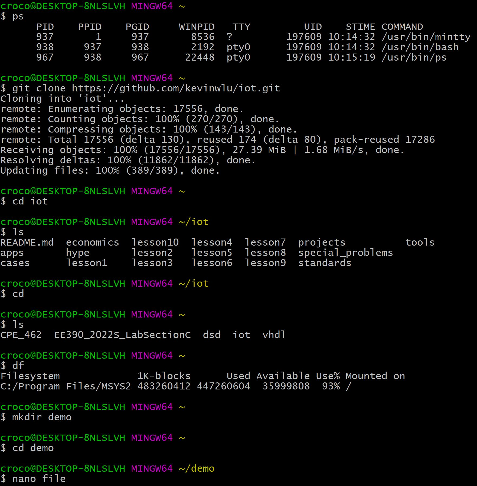
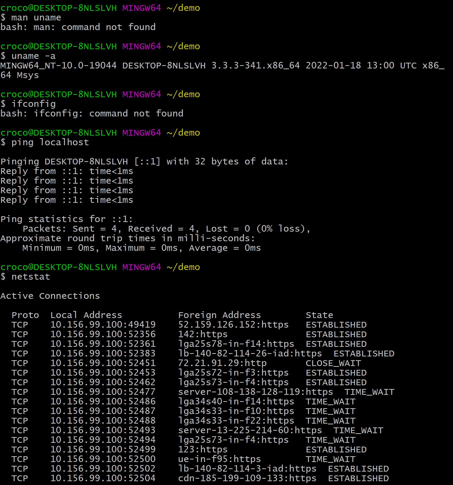
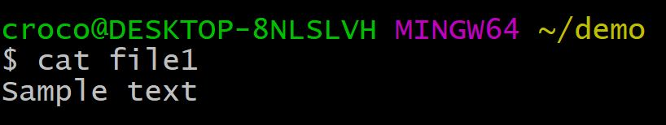

# Lab2 Command Line

The man command is not supported by my terminal, but I found this website https://www.geeksforgeeks.org/uname-command-in-linux-with-examples/ that explains the `uname` command.  I also found this explanation of `ifconfig` https://www.computerhope.com/unix/uifconfi.htm
