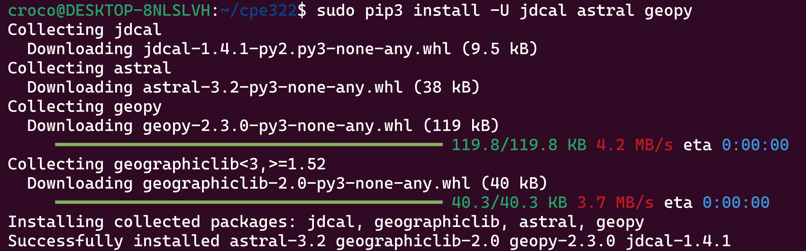
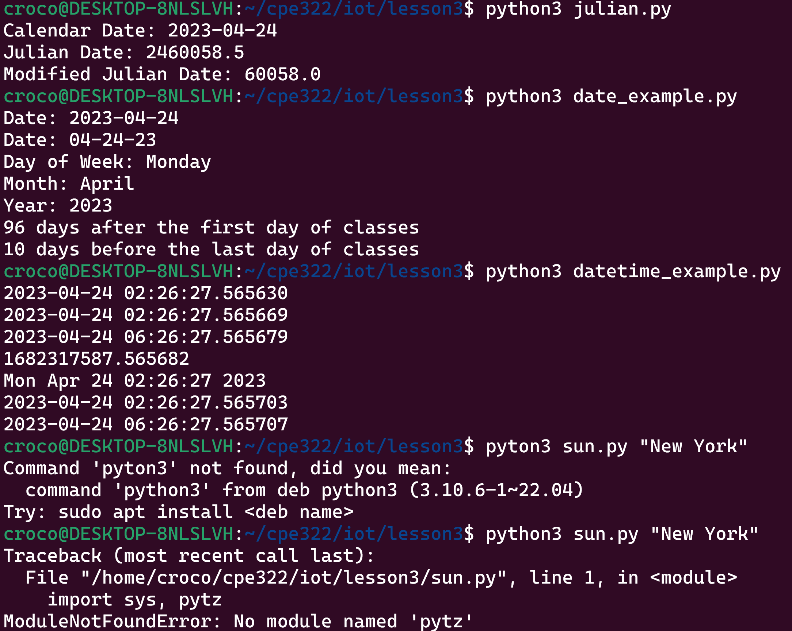
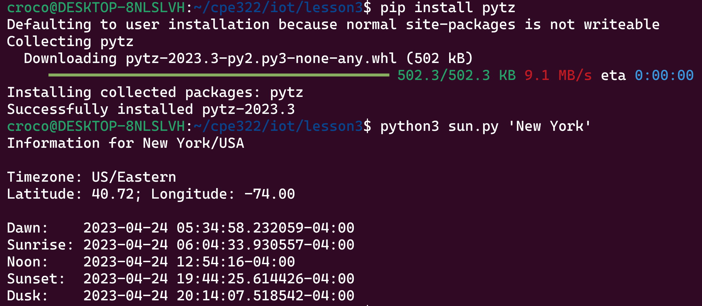
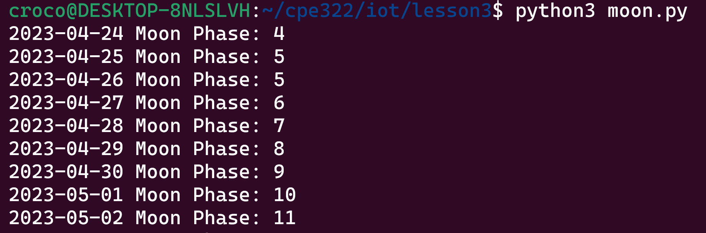
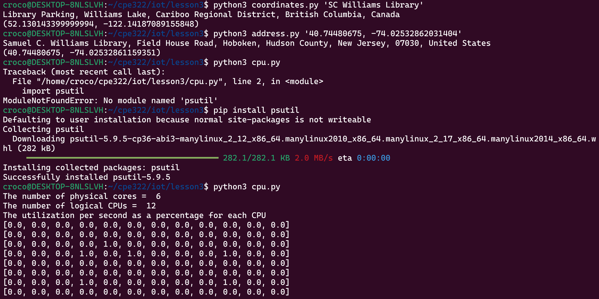
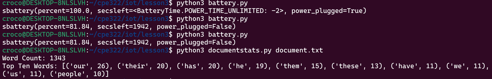

# Lab3 Python

Installing Python packages

Running Python programs for the lab assignment until an error occurs

Installing pytz lets Python get the time zone information properly

Moon phases

Another package was missing and needed to be installed

As can be seen from the 1942 seconds (about a half hour) of battery life at about 82% remaining, my laptop's battery has greatly degraded.

