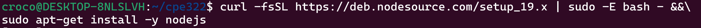
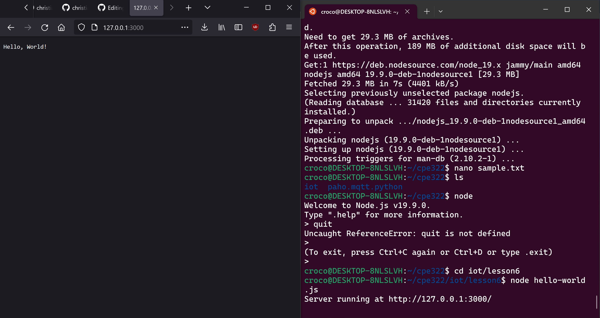
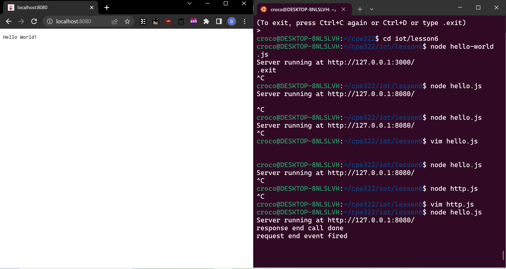
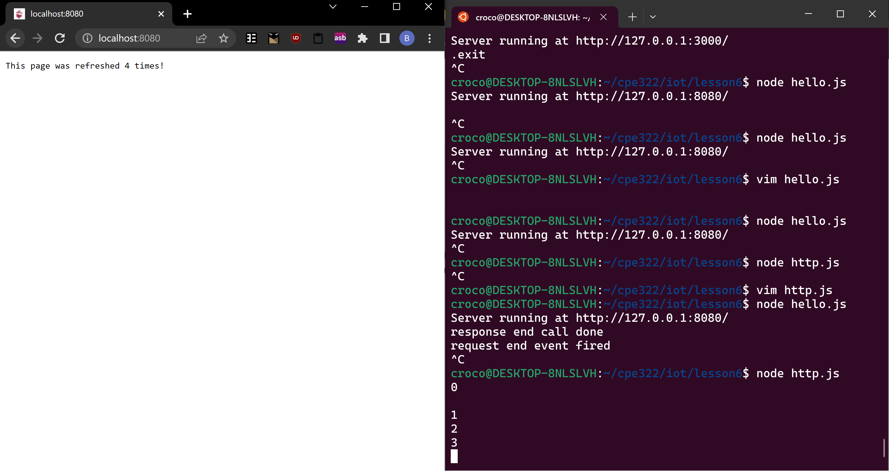
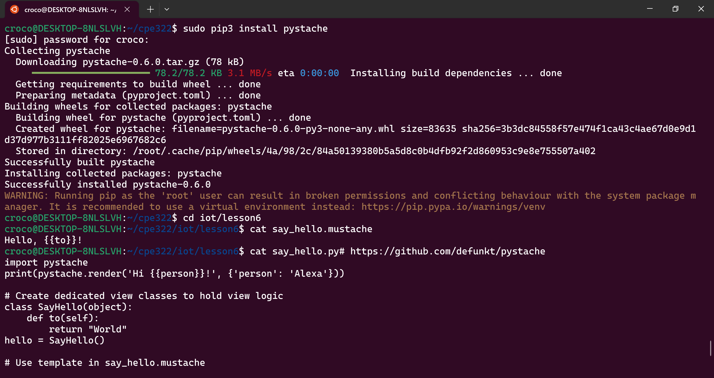
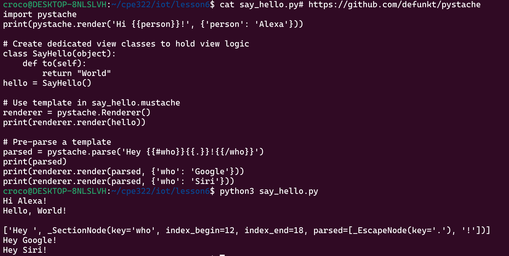

# Lab 6 Node.js and Pystache

Installing Node.js

Running hello-world.js

Running hello.js  
I kept getting a 404 error even if I used localhost:8080, but switching broswers from Firefox to Google Chrome fixed it.

Running http.js

Installing Pystache

Running say_hello.mustache

